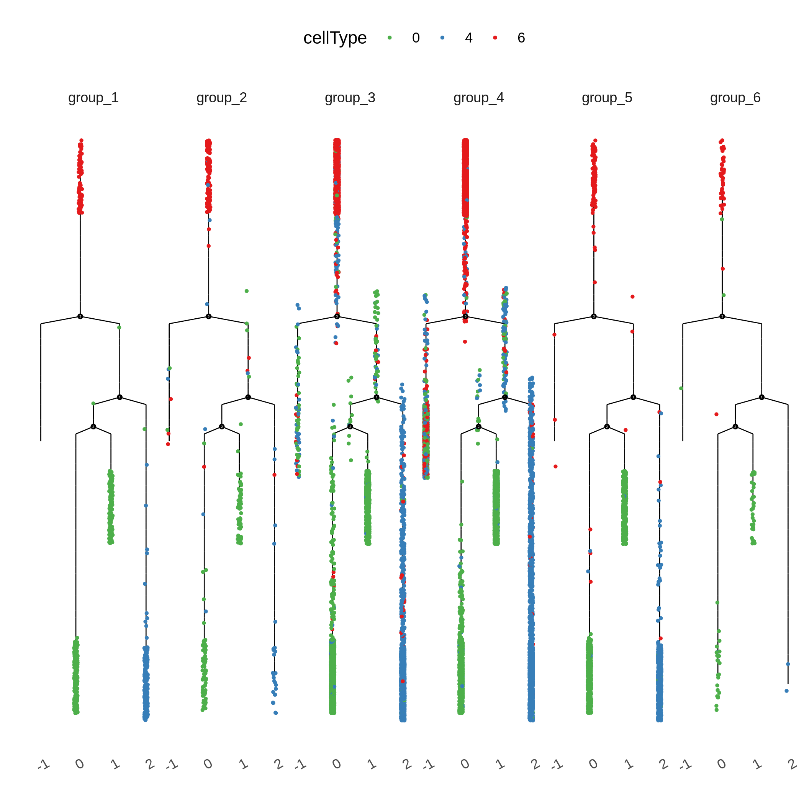

```{r setup, include=FALSE}
knitr::opts_chunk$set(echo = TRUE)
```

## Introduction

This is an R Markdown document about scRNA-seq pseudotime analysis using monocle2. The aim is to perform a few steps including clustering cells by tSNE method based on cell groups and then checking if there are any difference between the cluster results and the original cluster results from Seurat clustering. What's more, it's becoming more clear to identify which cluster is the trajectory root or which state is the root_state after performing some viusal plots. Main analysis is referenced in https://github.com/cole-trapnell-lab/monocle2-rge-paper/blob/master/Olsson_dataset_analysis_final.ipynb .

## Preview Original Integrated Data

* filtering: min.cell > 3, nFeature_RNA > 200, nCount_RNA > 1000
* clustring based on top 50 PCs
* visualizing reduced dimentions in 0.3 resolution of 23 samples


## Subset Cluster from Integrated Seurat Data

* In order to find potential differential trajectory between clusters, we choose cluster 6,0,4. 

```{r eval=FALSE}
library(Seurat)
library(monocle)
library(dplyr)
library(tidyr)
library(stringr)
library(cowplot)
library(ggsci)
library(clusterProfiler)

### subset dataset by given clusters, subset() or SubsetData()
load("/public/home/fanlj/chenhy/ara_Seurat_result/all/RData/RData60_2000/50pc/all_integarted_list_filter60_2000features.RData")
ls()
sub_data <-subset(ara_integrated, idents=c("6","0","4"))
cluster=Idents(sub_data)
table(cluster)
```

: table1

|cluster|cell_numbers|
|:---:|:---:|
|0|6723|
|4|5177|
|6|4142|

## Prepare the cds of selected clusters

* map TAIR id to SYMBOL id and ensure there is no duplicated item
* group cells based the sample information
```{r eval=FALSE}

count_matrix = sub_data@assays$RNA@counts
count_matrix[1:4,1:4]
dim(count_matrix)
###1. genes metadata
g.symbol = rownames(count_matrix) %>% bitr(,fromType = "TAIR", toType =c("SYMBOL") ,OrgDb= "org.At.tair.db")
uni.g.symbol = filter(g.symbol, !duplicated(g.symbol$TAIR) & !duplicated(g.symbol$SYMBOL))
dim(uni.g.symbol)
gene.ann = data.frame(gene_short_name = uni.g.symbol[,2], row.names = uni.g.symbol[,1])
head(gene.ann)

###2. cells metadata
sample.ann = data.frame(cells = colnames(count_matrix), cellType = cluster, row.names = colnames(count_matrix))
head(sample.ann)

###3. expr matrix
expr.symbol = left_join(uni.g.symbol, data.frame(TAIR = rownames(count_matrix),as.data.frame(count_matrix)),by = "TAIR")
expr.symbol[1:4,1:4]
expr.matrix = as(as.matrix(expr.symbol[,c(-1,-2)]), 'sparseMatrix') # remove column of TAIR and symbol
colnames(expr.matrix) = colnames(count_matrix)
rownames(expr.matrix) = rownames(gene.ann)
expr.matrix[1:4,1:4]
dim(expr.matrix)
dim(gene.ann)
dim(sample.ann)

###4. transfer to AnnotatedDataFrame 
pd <- new('AnnotatedDataFrame', data = sample.ann)
fd <- new('AnnotatedDataFrame', data = gene.ann)

###5. create cds object
cds <- newCellDataSet(expr.matrix, 
                      phenoData = pd, 
                      featureData = fd, 
                      lowerDetectionLimit = 1, 
                      expressionFamily = negbinomial.size())

###6. group cells based sample information
cells = str_split_fixed(rownames(pData(cds)),"_+", 2) %>% as.data.frame() %>% as_tibble() 
names(cells) = c("cell_barcode","sample")
cells1 = cells %>% mutate(cell_barcode = as.character(cell_barcode), sample = as.numeric(sample))
cells2 = cells %>% mutate(sample = case_when(
  sample %in% c(1,2)~"group_1",
  sample %in% c(3,4,5)~"group_2",
  sample %in% seq(6,15)~"group_3",
  sample %in% seq(16,20)~"group_4",
  sample %in% c(21,22)~"group_5",
  sample == 23~"group_6"))
pData(cds)$group = cells2$sample 

save(cds, file = "./Rdata/raw_monocle2_cds_in_counts.Rdata")
```

: table2

|group|cell_numbers|
|:---:|:---:|
|1|634|
|2|274|
|3|6570|
|4|7051|
|5|1408|
|6|105|

## Running dpFeature for selecting ordering gene

* using dispersion genes to cluster
* cluster cells into five groups(?) and select top 1K genes as the ordering genes

```{r eval=FALSE}
##1. quality control with detectGenes and subset
cds <- detectGenes(cds, min_expr = 0.1)
expressed_genes <- row.names(subset(cds@featureData@data,
                                    num_cells_expressed >= 5))
cds <- cds[expressed_genes,]
cds <- estimateSizeFactors(cds)
cds <- estimateDispersions(cds)
disp_table <- dispersionTable(cds) 
unsup_clustering_genes <- subset(disp_table, mean_expression >= 0.5) 
cds <- setOrderingFilter(cds, unsup_clustering_genes$gene_id)  
ggsave("./results/ordering_genes-1.png",plot_ordering_genes(cds))
save_plot("./results/pc_variance.png",plot_pc_variance_explained(cds, return_all = F),base_height = 8,base_asp = 1.3)

## dpFeature 
set.seed(2017)
cds <- reduceDimension(cds, max_components=2, norm_method = 'log', reduction_method = 'tSNE', num_dim = 12,  verbose = F,check_duplicates = F)
cds <- clusterCells(cds, verbose = F, num_clusters = 5)
save(cds, file = "./Rdata/clustered-cds.Rdata")
### check cluster results
ggsave("./results/cell-cluster-by-Cluster.png",plot_cell_clusters(cds, color_by = 'as.factor(Cluster)') + theme (legend.position="left", legend.title=element_blank()))
ggsave("./results/cell-cluster-by-sample-group.png",plot_cell_clusters(cds, color_by = 'group') + theme (legend.position="left", legend.title=element_blank()))
ggsave("./results/cell-cluster-by-cluster.png",plot_cell_clusters(cds, color_by = 'cellType') + theme (legend.position="left", legend.title=element_blank()))

pData(cds)$Cluster <- factor(pData(cds)$Cluster)
clustering_DEG_genes <- differentialGeneTest(cds, fullModelFormulaStr = '~Cluster' )
ordering_genes <- row.names(clustering_DEG_genes)[order(clustering_DEG_genes$qval)][1:1000]
save(ordering_genes, file = "./Rdata/top1k-diffGenes.Rdata")

```


## Reconstruct the developmental trajectory

* use the feature genes selected above to reconstruct the developmental trajectory

```{r eval=FALSE}
cds <- setOrderingFilter(cds, ordering_genes = c(ordering_genes))
cds <- reduceDimension(cds, verbose = F, scaling = T, max_components = 4, maxIter = 100, norm_method = 'log',  lambda = 20 * ncol(cds)) 
cds <- orderCells(cds)
ggsave("./results/cell-trajectory-by-sample-group.png",plot_cell_trajectory(cds, color_by = 'group'))
ggsave("./results/cell-trajectory-by-cellType.png",plot_cell_trajectory(cds, color_by = 'cellType'))
ggsave("./results/cell-trajectory-by-cellType-1.png",plot_cell_trajectory(cds, color_by = 'cellType')+facet_wrap(~cellType))
ggsave("./results/cell-trajectory-by-cellType-2.png",plot_cell_trajectory(cds, color_by = 'cellType',x = 1, y = 3)+facet_wrap(~cellType))  # in 3 dimential
```


## Show the complicate tree structure

* Trajectories are reconstructed in 4 dimensions but can be visualized as a tree layout in two dimensions

```{r eval=FALSE}
type_cols <- RColorBrewer::brewer.pal(3, name = 'Set1')
cluster_vec <- unique(pData(cds)$cellType)
cluster_cols <- type_cols
names(cluster_cols) <- cluster_vec

ggsave("./results/cell-trajectory-structure-1.png",plot_complex_cell_trajectory(cds[, ], color_by = 'cellType', show_branch_points = T, cell_size = 0.5, cell_link_size = 0.3) + scale_size(range = c(0.2, 0.2)) +facet_wrap(~group, nrow = 1) +
  theme(axis.text.x = element_text(angle = 30, hjust = 1)) + scale_color_manual(values = cluster_cols, name = "cellType"))
```



## Cell type distribution over the tree structure

* we can visualize the fraction of cell types over each state of the tree structure in a heatmap
* it's better to see that each state can be distincted by different cells

```{r eval=FALSE}
state_cluster_stat <- table(pData(cds)[, c('State', 'cellType')])
state_cluster_stat

state_cluster_stat <- apply(state_cluster_stat, 2, function(x) x / sum(x))
state_cluster_stat_ordered <- t(state_cluster_stat)
pheatmap::pheatmap(state_cluster_stat_ordered, cluster_cols = F, cluster_rows = F, color = colorRampPalette(RColorBrewer::brewer.pal(n=3, name='Greys'))(10), filename = "./results/state-cluster-pheatmap.png")
```


Note that the `echo = FALSE` parameter was added to the code chunk to prevent printing of the R code that generated the plot.
